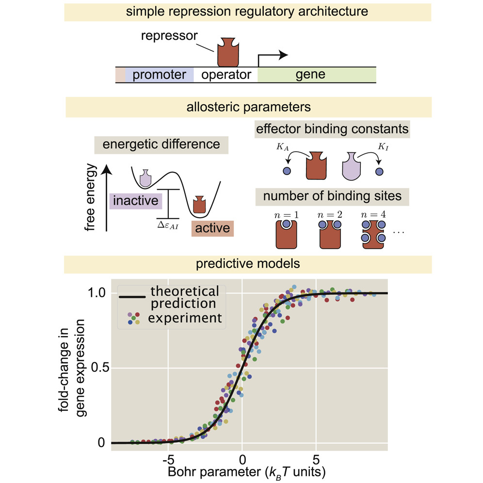
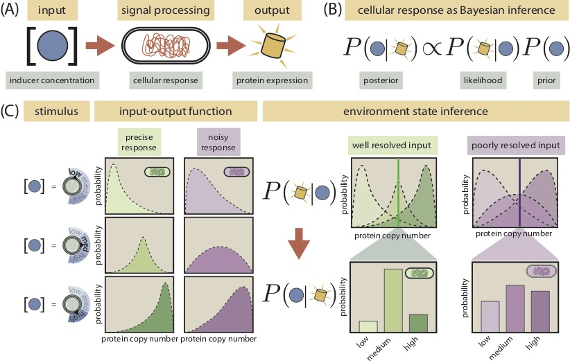

Here is a short list of some of my current and past research projects. Whenever
available, I provide links to the publication PDF, a personalized website for
each of the papers, and the corresponding GitHub repositories.

## Quantitative modeling of gene regulation via allosteric proteins

<a href="https://www.sciencedirect.com/science/article/pii/S2405471218300577">
  <button>
  open access PDF
  <i class="fa fa-file-pdf-o" aria-hidden="true"></i>
  </button>
  </a>
  <a href="http://www.rpgroup.caltech.edu/mwc_induction/">
  <button>
  paper website
  <i class="fa fa-window-restore" aria-hidden="true"></i>
  </button>
  </a>
  <a href="http://www.github.com/rpgroup-pboc/mwc_induction">
  <button>
  github repository
  <i class="fa fa-github-square" aria-hidden="true"></i>
  </button>
  </a>

Despite lacking a nervous system, single bacterial cells are capable of making
decisions given signals from their surroundings. How can individual molecules
sense and transmit these signals? The answer comes from one of the crowning
scientific achievements of the past century:
[allostery](https://en.wikipedia.org/wiki/Allosteric_regulation). Simply stated,
allostery is the property of certain macromolecules to exist in multiple
conformations with different properties. For example, transcription factors
—proteins that control gene expression— can be active (able to bind the DNA) or
inactive (unable to bind DNA) depending on the concentration of a signaling
molecule.

In a 2018 paper, [our socialist
team](http://www.rpgroup.caltech.edu/mwc_induction/posts/2016/12/18/people.html)
wrote down a theoretical model that predicts the expression level of a gene
regulated by an allosteric transcription factor. We then tested the model
experimentally, showing that the model was able to predict how changes to the
regulation of the gene translate to changes in the cellular response.

## Predicting how many bits of information cells can extract from the environment

<a href="https://journals.aps.org/pre/abstract/10.1103/PhysRevE.102.022404">
<button>
open access PDF
<i class="fa fa-file-pdf-o" aria-hidden="true"></i>
</button>
</a>
<a href="https://www.rpgroup.caltech.edu/chann_cap/">
<button>
paper website
<i class="fa fa-window-restore" aria-hidden="true"></i>
</button>
</a>
<a href="https://github.com/RPGroup-PBoC/chann_cap">
<button>
github repository
<i class="fa fa-github-square" aria-hidden="true"></i>
</button>
</a>

Living organisms are constantly sensing intra and extracellular cues and
responding accordingly. The quality and precision of such responses can mean the
difference between surviving or not certain challenges; therefore, there is a
constant selection pressure for cells to gather enough information from any
stimulus in order to build an adequate response. In this context, the
information that cells can obtain has a precise mathematical definition measured
—just as in computers— in bits.

In a 2020 publication our goal was to predict how many bits of information can
a cell harboring a simple genetic circuit process. To do so, I wrote down a
theoretical model to predict the full distribution of gene expression based on
the physics of this molecular process. I calibrated our model with previous
information in order to perform parameter-free predictions. To test the model, I
compared the predictions with experimental single-cell gene expression data
finding great agreement.

