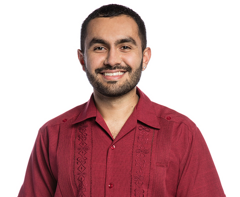

::: {.hero}

::: {.hero-copy}

::: {.eyebrow}

Computational biology · Biophysics · Machine learning

:::

# What can we reliably learn from noisy biological measurements?

::: {.role}

I'm Manuel Razo-Mejia, a Scientist II in Computational Biology at Altos Labs.

:::

I build biophysical models, Bayesian methods, and scientific software to understand biological data. My research spans single-cell genomics, evolutionary dynamics, and gene regulation, with experiments shaping how I model measurements and test predictions.

::: {.actions}

[Explore research](projects/index.qmd) [Download CV](cv/cv.pdf) [Email me](mailto:manuel.razo.m@gmail.com)

:::

:::

::: {.hero-portrait}

:::

:::

## Selected research

::: {.research-grid}

::: {.research-card}

::: {.meta}

Experimental evolution · PLoS Computational Biology, 2024

:::

### [Measuring fitness with uncertainty](projects/index.qmd#fitness)
Bayesian inference for pooled competition assays, from DNA barcode counts to relative fitness estimates. Released as BarBay.jl.

:::

::: {.research-card}

::: {.meta}

Geometric deep learning · PRX Life, 2026

:::

### [Learning evolutionary landscapes](projects/index.qmd#landscapes)
Using geometry-aware autoencoders to uncover structure in phenotype-to-fitness maps and study antibiotic resistance.

:::

::: {.research-card}

::: {.meta}

Single-cell genomics · Publication in preparation

:::

### [Reliable single-cell inference](projects/index.qmd#scribe)
SCRIBE models measurement noise and uncertainty in single-cell RNA sequencing with scalable Bayesian inference.

[Explore capabilities](software/index.qmd#scribe)

:::

:::

## From measurements to models

I work across mechanistic modeling, statistical inference, and deep learning, choosing the method around the biological question. I also build the software that lets other researchers inspect assumptions and reproduce an analysis.

Previously, I was a Schmidt Science Fellow and postdoctoral scholar at Stanford, following a PhD in Biochemistry and Molecular Biophysics at Caltech. [More about my background](about/index.qmd).