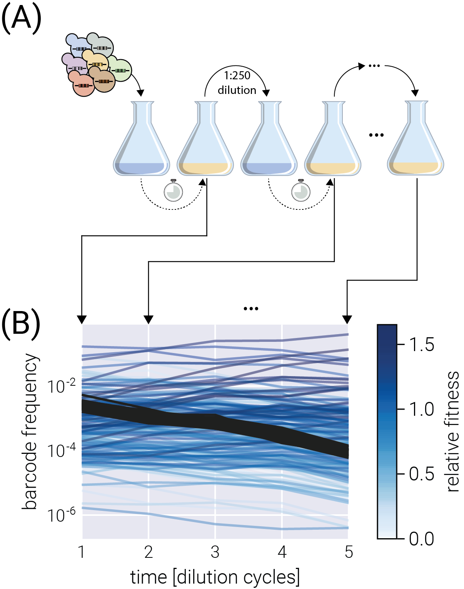
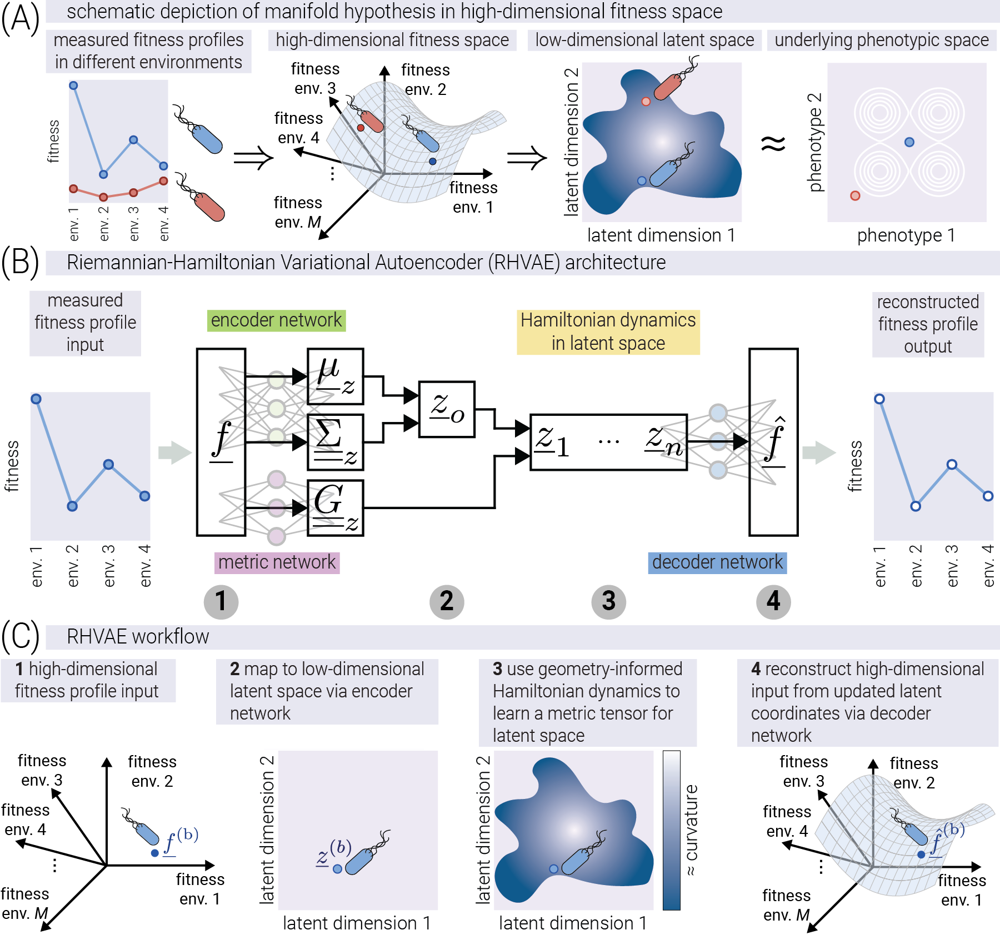
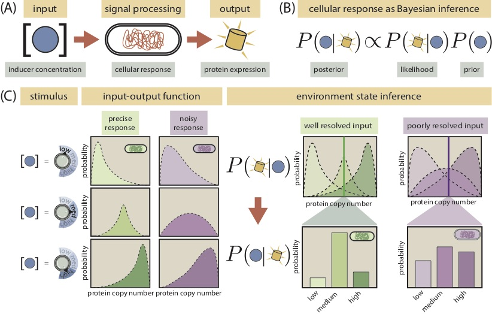

My research asks how to extract reliable biological understanding from imperfect measurements. I develop models, test their assumptions against data, and build reusable software around the resulting analyses.

::: {.research-section}
## Measuring fitness with uncertainty {#fitness}

::: {.meta}
Bayesian inference · DNA barcode assays · PLoS Computational Biology, 2024
:::

How confidently can we distinguish the fitness of cellular lineages in a pooled competition experiment? Barcode counts offer a powerful readout, but biological and measurement noise complicate their interpretation.

I developed a Bayesian framework for relative fitness inference and implemented it in **BarBay.jl**. The framework propagates uncertainty and uses variational inference to make analysis practical across many barcodes. Extensions handle multiple environments, experimental replicates, and barcodes linked to the same genotype.

**Validation and use.** Simulated assays provide known fitness values against which to assess inference. Posterior predictive checks test whether the fitted model can reproduce observed trajectories. The resulting estimates and uncertainty intervals support comparisons between lineages, with the analysis and figure-generation code available for inspection.

[Paper](https://journals.plos.org/ploscompbiol/article?id=10.1371/journal.pcbi.1011937) · [Reproducible analysis](https://mrazomej.github.io/bayesian_fitness/paper.html) · [BarBay documentation](https://mrazomej.github.io/BarBay.jl/stable/)
:::

::: {.research-section}
## Learning the geometry of evolutionary landscapes {#landscapes}

::: {.meta}
Representation learning · Evolutionary dynamics · PRX Life, 2026
:::

Can fitness measurements across environments reveal the biological structure underlying adaptation? I used geometry-aware variational autoencoders to study the relationship between high-dimensional fitness profiles and lower-dimensional phenotype spaces.

The work connects a model of evolutionary dynamics with representation learning, then applies the approach to antibiotic-resistance measurements in *E. coli*. Learning the geometry alongside the embedding gives a way to interpret distances in the latent representation.

**Validation and result.** I evaluated the approach on simulated dynamics with known phenotypic structure and on experimental antibiotic-response data, comparing nonlinear representations with linear dimensionality reduction. The study showed improved prediction of held-out antibiotic responses relative to linear approaches in the dataset studied.

[Published paper](https://doi.org/10.1103/zyj4-qt72) · [Paper and analysis](https://mrazomej.github.io/antibiotic_landscape/paper.html) · [Code](https://github.com/mrazomej/antibiotic_landscape)
:::

::: {.research-section}
## Reliable inference from single-cell RNA sequencing {#scribe}

::: {.meta}
SCRIBE · Bayesian modeling · Publication in preparation
:::

Single-cell measurements combine biological variation with technical noise. How that noise is modeled affects what we can conclude about differences between cells.

I am developing **SCRIBE**, a framework for single-cell RNA-seq analysis that explicitly accounts for measurement noise and uncertainty. Its capabilities include GPU-accelerated Bayesian inference, variational inference and MCMC, and models that address variability in measurement and capture efficiency. It is implemented in Python using JAX and NumPyro.

The aim is to make rigorous inference practical for high-dimensional biological data while keeping model assumptions interpretable.

::: {.note}
SCRIBE is under active development, and a publication is being prepared. The source code is currently private.
:::

[Software overview](../software/index.qmd#scribe) · [Contact me](mailto:manuel.razo.m@gmail.com)
:::

::: {.research-section}
## Predicting and measuring gene regulation {#gene-regulation}

::: {.meta}
Statistical physics · Information theory · Experimental biophysics
:::

During my PhD at Caltech, I studied how genetic circuits sense environmental signals and produce cellular responses. I combined biophysical modeling with fluorescence microscopy experiments to test predictions about gene regulation.

**Information processing in a genetic circuit (2020).** I developed a model of gene-expression distributions and used independently constrained parameters to predict the information a circuit can transmit. Comparison with single-cell measurements connected molecular mechanisms to the variability of cellular responses.

[Paper](https://journals.aps.org/pre/abstract/10.1103/PhysRevE.102.022404) · [Analysis and data](https://www.rpgroup.caltech.edu/chann_cap/) · [Code](https://github.com/RPGroup-PBoC/chann_cap)

**Allosteric regulation (2018).** With collaborators, I developed and experimentally tested a predictive model connecting the properties of allosteric transcription factors to gene expression. This work grounds my computational approach in how biological measurements are actually made.

[Paper](https://www.sciencedirect.com/science/article/pii/S2405471218300577) · [Project website](https://www.rpgroup.caltech.edu/mwc_induction/) · [Code](https://github.com/RPGroup-PBoC/mwc_induction)
:::
